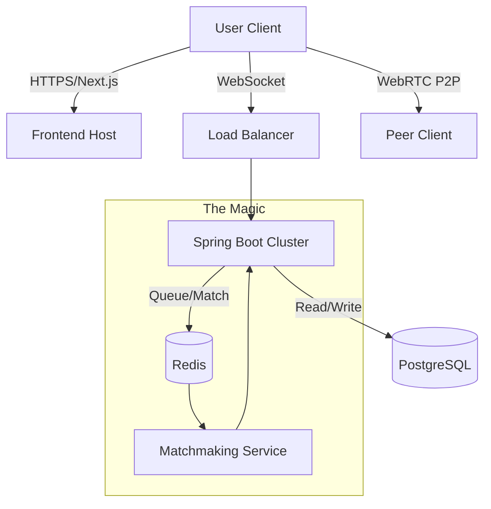

Here is a `PLAN.md` drafted for your team. It is structured to guide a team of 6 through building a high-scale, resume-grade application with the specific Vercel-like aesthetic you are targeting.

Given the name **uKnight**, I have positioned this as a university-centric platform (starting with UCF as the pilot) to differentiate it from a generic Omegle clone and solve the "random stranger" safety issue, which drastically increases its value as a startup.

---

```markdown
# uKnight: Project Master Plan

**Mission:** To create a high-fidelity, university-exclusive distinct connection platform.
**Aesthetic:** "Vercel-Minimalism" — Dark mode default, sans-serif typography (Inter/Geist), high contrast, zero clutter.
**Core Value Prop:** The spontaneity of Omegle, but safe and verified for the university community.

---

## 1. The Stack (High-Performance & Scalable)

### **Frontend (The "Vercel" Look)**
* **Framework:** **Next.js 14+ (App Router)**.
    * *Why:* Industry standard for high-performance React apps. Excellent for SEO and "edge" look.
* **Styling:** **Tailwind CSS** + **Framer Motion**.
    * *Why:* Tailwind ensures the minimalistic/clean constraint; Framer provides the subtle, high-quality animations (smooth fade-ins, modal pops) typical of Vercel products.
* **UI Library:** **Shadcn/ui**.
    * *Why:* It allows for copy-paste accessible components that look professional and "monochrome-clean" out of the box.

### **Backend (The Engine)**
* **Core:** **Java Spring Boot**.
    * *Why:* Robustness, strict typing, and massive scalability. Great for managing complex WebSocket states.
* **Real-time Communication:** **WebSockets (STOMP protocol)**.
    * *Why:* Essential for text chat and signaling for video.
* **Video/Audio:** **WebRTC** (Peer-to-Peer).
    * *Why:* Low latency video. The server only handles the "handshake" (signaling), keeping bandwidth costs low.
* **Matchmaking Queue:** **Redis**.
    * *Why:* In-memory data store is required to match thousands of users in milliseconds without hitting the main database constantly.

### **Data & Infrastructure**
* **Database:** **PostgreSQL** (User profiles, chat logs for moderation, reports).
* **Authentication:** **OAuth2** (Google) + **University Email Verification (.edu)**.
    * *Crucial:* This is the "u" in uKnight. Restricting to verified students creates a "walled garden" that is safer and higher value than Omegle.
* **Deployment:** Docker containers (Backend) + Vercel (Frontend).

---

## 2. Architecture Overview



---

## 3. MVP Features (The "Must-Haves")

### **Phase 1: The Skeleton**

1. **Auth System:** Login with `.edu` email only.
2. **Lobby UI:** Minimalistic dashboard showing "Online Knights" count.
3. **The Queue:** A simple "Find Match" button that connects to WebSocket and waits for a pairing.

### **Phase 2: The Connection**

1. **WebRTC Implementation:** Establishing video/audio streams between two matched peers.
2. **Text Chat:** Fallback text chat alongside video.
3. **Skip Logic:** The ability to disconnect and immediately re-queue (critical Omegle feature).

### **Phase 3: The "Resume Builder" Features (Differentiation)**

1. **Interest Tags:** Match based on major (e.g., "CS", "Nursing") or interests.
2. **AI Moderation (The "Safety" Layer):** * Integrate a light ML model (or API) to detect inappropriate content in video frames or chat logs.
* *Note:* This adds massive technical depth to the resume.


---

## 4. Team Roles (Squad of 6)

To maximize efficiency and resume impact, split into sub-teams:

**Team A: The Experience (Frontend & Design) - 2 Members**

* **Focus:** Next.js architecture, WebRTC client-side handling, UX/UI, Tailwind styling.
* **Goal:** Make it feel like a Silicon Valley product. 60 FPS animations, responsive video grid.

**Team B: The Engine (Backend & Logic) - 2 Members**

* **Focus:** Spring Boot API, WebSocket handling, Redis matchmaking algorithm.
* **Goal:** Ensure 0% match collisions and sub-100ms match times.

**Team C: Infrastructure & Intelligence - 2 Members**

* **Focus:** DevOps (Docker/Cloud), Database Schema, TURN/STUN server setup (for WebRTC), and the AI Moderation layer.
* **Goal:** Ensure the site doesn't crash when 1,000 users log in, and handle the "nasty" side of peer-to-peer video.

---

## 5. Roadmap to Launch

* **Sprint 1 (Weeks 1-2):** "Hello World" - Frontend deployed on Vercel, Spring Boot returning JSON, basic WebSocket connection working.
* **Sprint 2 (Weeks 3-4):** "The Mirror" - Users can see their own camera and log in with email.
* **Sprint 3 (Weeks 5-6):** "The Handshake" - Two users can connect via WebRTC and exchange video.
* **Sprint 4 (Weeks 7-8):** "The Polish" - UI refinement, Redis queue optimization, bug fixing.
* **Launch:** Soft launch to UCF Computer Science Discord/Reddit.