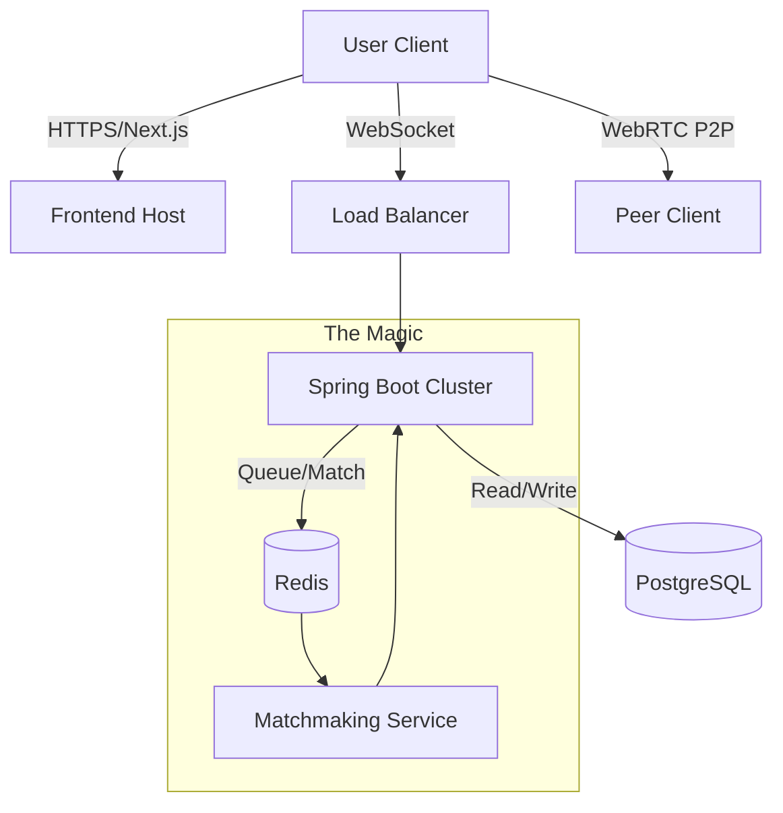

# uKnight

**Mission:** To create a high-fidelity, university-exclusive distinct connection platform.
**Aesthetic:** "Vercel-Minimalism" — Dark mode default, sans-serif typography (Inter/Geist), high contrast, zero clutter.

[](https://nextjs.org/)
[](https://spring.io/projects/spring-boot)
[](https://www.postgresql.org/)
[](https://redis.io/)
[](https://tailwindcss.com/)

---

## 🚀 Overview

uKnight is where spontaneity meets safety. Inspired by platforms like Omegle but designed exclusively for the university community, uKnight leverages verified `.edu` authentication to create a "walled garden" for students to connect, collaborate, and network.

### Why uKnight?
*   **Verified Community:** Only students with valid university emails can join.
*   **High Performance:** Real-time video/audio via WebRTC with sub-100ms matchmaking.
*   **Premium UX:** A sleek, minimal interface designed for speed and clarity.

---

## 🛠️ The Stack

### Frontend
- **Framework:** Next.js 14+ (App Router)
- **Styling:** Tailwind CSS + Framer Motion (for high-fidelity animations)
- **UI:** Shadcn/ui (Accessible, monochrome-clean components)

### Backend
- **Core:** Java Spring Boot 21
- **Real-time:** WebSockets (STOMP protocol)
- **Matchmaking:** Redis In-Memory Data Store
- **Database:** PostgreSQL

---

## 🏗️ Architecture



---

## ✨ Features

### Phase 1: The Skeleton
- [x] **Auth System:** Secure login restricted to `.edu` domains.
- [x] **Lobby UI:** Real-time "Online Knights" counter.
- [/] **Matchmaking:** WebSocket-driven pairing queue.

### Phase 2: The Connection (In Progress)
- [ ] **WebRTC Video:** Ultra-low latency P2P video/audio streams.
- [ ] **Instant Skip:** One-click disconnect and re-queue.
- [ ] **Text Fallback:** Persistent chat during video sessions.

### Phase 3: The Polish
- [ ] **Interest Matching:** Tag-based filtering (e.g., Major, Hobbies).
- [ ] **AI Guard:** Real-time moderation layer for safety.

---

## 🚦 Getting Started

### Prerequisites
- Docker & Docker Compose
- Node.js 18+
- Java 21 & Maven

### Quick Start (Docker)
The easiest way to get uKnight running locally is via Docker Compose:

```bash
docker-compose up --build
```

- **Frontend:** [http://localhost:3000](http://localhost:3000)
- **Backend:** [http://localhost:8080](http://localhost:8080)

### Manual Setup

#### Backend
```bash
cd backend/server
./mvnw spring-boot:run
```

#### Frontend
```bash
cd frontend
npm install
npm run dev
```

---

## 📄 License
This project is licensed under the MIT License - see the [LICENSE](LICENSE) file for details.

---

<p align="center">Built with ❤️ for the University Community.</p>
